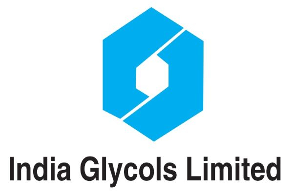
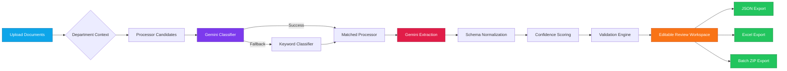
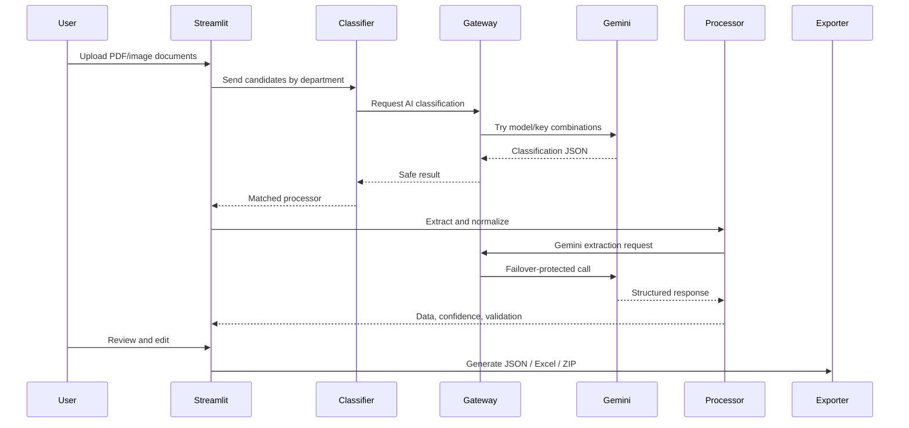
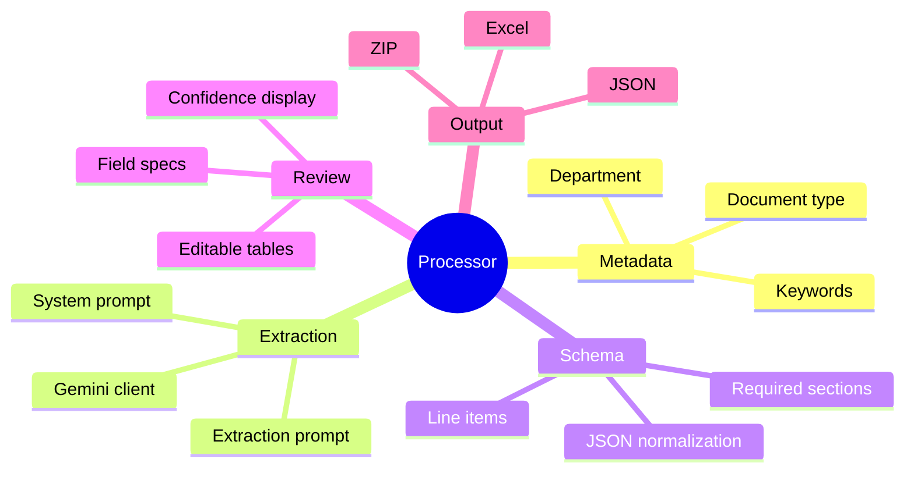
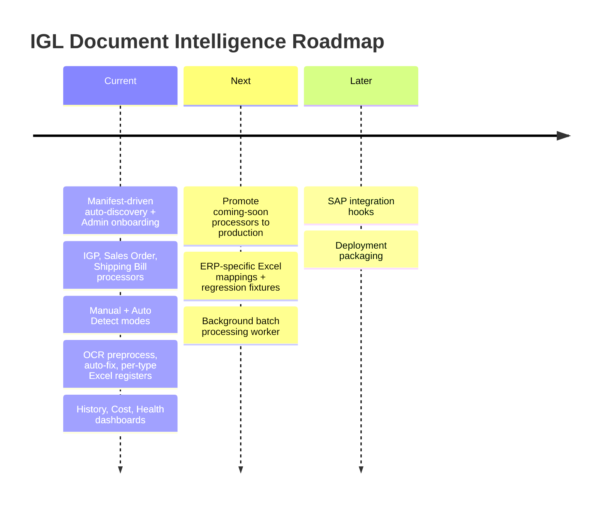

<p align="center">
  
</p>

<div align="center">
  

  <br />
  <br />

  <a href="#mission-control">
    
  </a>
  <a href="#launch-sequence">
    
  </a>
  <a href="#processor-grid">
    
  </a>
  <a href="#security-vault">
    
  </a>

  <br />
  <br />

  

  <br />
  <br />

  
  
  
  
  
  
</div>

---

<a id="mission-control"></a>

## Mission Control

<table>
  <tr>
    <td width="25%" align="center">
      
      <br />
      PDFs, scanned documents, and image files
    </td>
    <td width="25%" align="center">
      
      <br />
      Gemini-powered document routing with keyword fallback
    </td>
    <td width="25%" align="center">
      
      <br />
      Confidence scores, validation, preview, and editable fields
    </td>
    <td width="25%" align="center">
      
      <br />
      JSON, Excel, and batch ZIP packages
    </td>
  </tr>
</table>

`po-processor` is a Streamlit-based AI document intelligence platform built for
business teams that need clean, reviewable, ERP-ready data from unstructured
documents.

**Version 2.0** is a manifest-driven, auto-discovering plugin platform. It runs
in **Manual** mode (Department → Business Process — the accurate default) or
**Auto Detect** mode (the AI picks the process). Live processors today are
**Store → IGP**, **Marketing → Sales Order**, and **Export → Shipping Bill**;
every other process across 11 departments is registered as *coming soon*.
Adding a processor is just adding a folder with a `manifest.json` (or using the
built-in Admin panel) — no code changes and no hardcoded routing.

---

## Signal Panel

<table>
  <tr>
    <td align="center"><b>Document Intake</b></td>
    <td align="center"><b>AI Reliability</b></td>
    <td align="center"><b>Human Review</b></td>
    <td align="center"><b>Structured Output</b></td>
  </tr>
  <tr>
    <td align="center">
      
      <br />
      
    </td>
    <td align="center">
      
      <br />
      
    </td>
    <td align="center">
      
      <br />
      
    </td>
    <td align="center">
      
      <br />
      
    </td>
  </tr>
</table>

---

## Supported Documents

<table>
  <tr>
    <th>Zone</th>
    <th>Document</th>
    <th>Processor</th>
    <th>Review UI</th>
    <th>Exports</th>
  </tr>
  <tr>
    <td><b>Store</b></td>
    <td>IGP (Inward Gate Pass)</td>
    <td></td>
    <td>Fields, line items, confidence, validation, preview</td>
    <td>Excel Register, per-doc XLSX</td>
  </tr>
  <tr>
    <td><b>Marketing</b></td>
    <td>Sales Order</td>
    <td></td>
    <td>Fields, line items, confidence, validation, preview</td>
    <td>Excel Register, per-doc XLSX</td>
  </tr>
  <tr>
    <td><b>Export</b></td>
    <td>Shipping Bill</td>
    <td></td>
    <td>Fields, line items, confidence, validation, preview</td>
    <td>Excel Register, per-doc XLSX</td>
  </tr>
  <tr>
    <td colspan="5" align="center"><i>Store · Marketing · Finance · Export · Supply Chain · HR · Operations · Mechanical · Chemical · Production · Management — remaining processes register as <b>Coming Soon</b></i></td>
  </tr>
</table>

---

## System Flow



---

## Feature Reactor

| Module | What It Delivers | Status |
| --- | --- | --- |
| Manual + Auto Detect modes | Department → Business Process, or AI-chosen process |  |
| Manifest auto-discovery | Processors loaded from `processors/<key>/manifest.json` |  |
| OCR preprocessing | Auto-orient, deskew, denoise, contrast (scanned PDFs/images) |  |
| Extraction engine | Multi-page, handwriting-aware, schema-shaped JSON |  |
| Auto-Fix | Deterministic repairs with per-fix confidence before validation |  |
| Confidence layer | Overall + field-level confidence bands (95 / 75 thresholds) |  |
| Inline editor + audit | Edit fields/line items; AI→user edits recorded |  |
| Excel registers | One workbook per type, one row per PDF, template styling preserved |  |
| Extraction cache | Repeat uploads skip Gemini (hash + processor + prompt version) |  |
| Dashboards | History (re-download), Cost (₹), Processor Health |  |
| Admin panel | Onboard processors by upload; draft → testing → production |  |
| AI Gateway | Multi-key + multi-model rotation, fallback, graceful failover |  |

---

## Tech Wall

<p align="center">
  
  
  
  
  
  
  
  
</p>

---

<a id="launch-sequence"></a>

## Launch Sequence

<table>
  <tr>
    <td width="50%">

### Clone

```bash
git clone <your-repository-url>
cd po-processor
```

### Install

```bash
python -m venv .venv
.venv\Scripts\activate
pip install -r requirements.txt
```

  </td>
  <td width="50%">

### Configure

```env
GEMINI_API_KEY_1=your_first_gemini_api_key
GEMINI_API_KEY_2=your_second_gemini_api_key
GEMINI_MODEL_1=gemini-2.5-flash
GEMINI_MODEL_2=gemini-2.5-flash-lite
APP_ENV=production
```

### Run

```bash
streamlit run app.py
```

  </td>
  </tr>
</table>

Open the local Streamlit URL:

```text
http://localhost:8501
```

For macOS/Linux activation, use:

```bash
source .venv/bin/activate
```

---

## Operator Workflow



---

<a id="processor-grid"></a>

## Processor Grid

Every document type plugs into the same engine by declaring a `ProcessorSpec`.

<table>
  <tr>
    <th>Processor Asset</th>
    <th>Purpose</th>
  </tr>
  <tr>
    <td><code>ProcessorSpec</code></td>
    <td>Declares fields, sections, line items, labels, and classification metadata.</td>
  </tr>
  <tr>
    <td>Prompt files</td>
    <td>Control Gemini system behavior and extraction instructions.</td>
  </tr>
  <tr>
    <td>JSON schema</td>
    <td>Defines normalized output shape.</td>
  </tr>
  <tr>
    <td>Validator</td>
    <td>Reports document-specific business issues.</td>
  </tr>
  <tr>
    <td>Excel generator</td>
    <td>Builds ERP-friendly workbook exports.</td>
  </tr>
</table>



---

## Project Map

```text
po-processor/
|-- app.py                         # Shell: modes, nav, registers, dashboards
|-- ai_gateway.py                  # Gemini key/model failover gateway
|-- api_key_manager.py             # API key discovery and rotation
|-- classifier.py                  # AI + keyword document classifier (Auto Detect)
|-- config.py                      # App settings + shared singletons
|-- preprocess.py                  # OCR preprocess (orient/deskew/denoise/contrast)
|-- cache.py                       # Extraction cache (skip Gemini on repeats)
|-- cost.py                        # Token capture + INR cost rollups
|-- history.py                     # Per-batch processing log + register re-download
|-- admin.py                       # Processor onboarding + lifecycle (no code)
|-- consolidated_excel.py          # One-row-per-PDF registers (template styling)
|-- document_state.py              # Document state, audit, batch exports
|-- engine.py                      # Generic review/edit/export workspace
|-- gemini.py                      # Gemini client (parts + usage capture)
|-- processing.py                  # preprocess->classify/assign->extract->auto-fix
|-- preview.py                     # PDF/image preview rendering
|-- ui.py                          # Theme and Streamlit UI helpers
|-- departments.py                 # 11-department catalog
|-- processors/
|   |-- base.py                    # Processor interface
|   |-- spec.py                    # ProcessorSpec + from_manifest + export specs
|   |-- folder_processor.py        # Manifest-driven plugin
|   |-- discovery.py               # Filesystem discovery of manifests
|   |-- bootstrap.py               # Discovery entry point / refresh
|   |-- registry.py                # Registry + department/status lookups
|   |-- generic_validator.py       # Spec-driven validate + auto-fix
|   |-- generic_exporter.py        # Spec-driven per-doc workbook
|   |-- igp/                       # Store -> IGP (production)
|   |-- purchase_order/            # Marketing -> Sales Order (production)
|   |-- shipping_bill/             # Export -> Shipping Bill (production)
|   `-- <key>/                     # manifest.json, schema/, prompts/v1/,
|                                  #   validator.py?, exporter.py?, templates/, samples/
|-- utils/                         # normalize_to_schema, confidence, JSON, files
|-- assets/                        # Branding assets
|-- outputs/                       # Generated artifacts, cache, usage, history (git-ignored)
|-- requirements.txt
`-- README.md
```

---

<a id="security-vault"></a>

## Security Vault

<table>
  <tr>
    <td align="center">
      
    </td>
    <td>API keys are loaded from environment variables only.</td>
  </tr>
  <tr>
    <td align="center">
      
    </td>
    <td>Key values are never logged, displayed, saved, or placed in exceptions.</td>
  </tr>
  <tr>
    <td align="center">
      
    </td>
    <td>Operational status references keys only by number, such as Key #1.</td>
  </tr>
  <tr>
    <td align="center">
      
    </td>
    <td>Keep `.env`, generated exports, debug logs, and sensitive documents out of Git.</td>
  </tr>
</table>

---

## Roadmap Console



---

<p align="center">
  
</p>

<div align="center">
  
  
  
</div>
